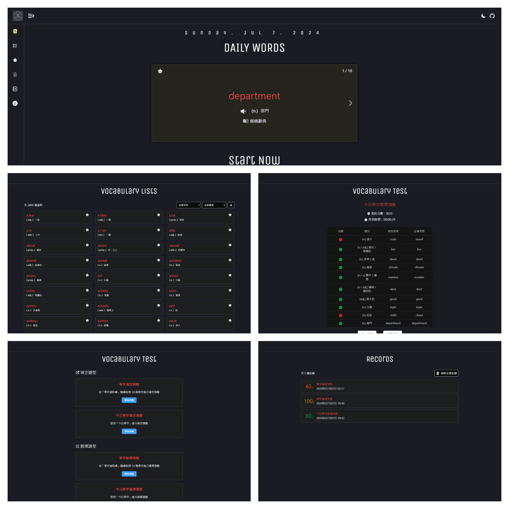
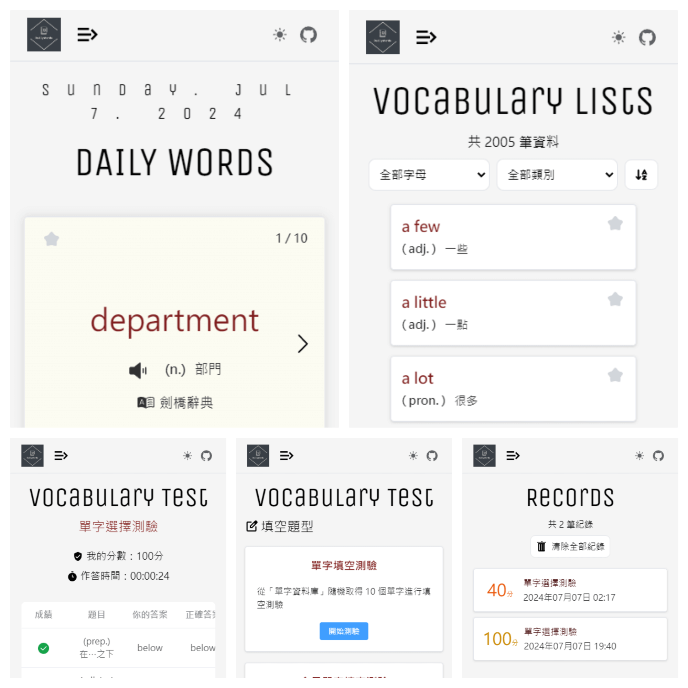

<div align="center">

<h2>Daily Words | 每日單字</h2>
<p>一個學習英文單字的小專案，擁有 2000 個單字的資料庫，並包含每日單字、收藏功能、多種單字測驗等功能。</p>
</div>

## 🪴 專案資訊

-   😝 Demo 預覽：https://daily10words.vercel.app/
-   🎯 使用技術：[Nuxt3](https://nuxt.com/)、[Vue.js](https://cn.vuejs.org/)、[Pinia](https://pinia.vuejs.org/)、[Element-plus](https://element-plus.org/)、[Tailwindcss](https://www.tailwindcss.cn/)、[Google Sheets API](https://developers.google.com/sheets/api/guides/concepts?hl=zh-tw)、[Web Speech API](https://developer.mozilla.org/en-US/docs/Web/API/Web_Speech_API)、[Vercel](https://vercel.com/)、[Dexie](https://dexie.org/docs/Tutorial/Vue)

## 📜 從這個專案學到了什麼

-   使用 Nuxt.js + TypeScript 開發網頁專案
-   採用 Element-plus 作為基礎，搭配 Tailwindcss 客製化樣式
-   使用 Google Sheets 建立單字資料庫，並透過 Google Sheets API 串接相關功能
-   使用 Web Speech API 實現單字發音功能
-   使用 Pinia 管理全域狀態
-   使用 Vercel 作為專案部署的 Serverless 平台
-   使用 Dexie 操作 IndexedDB 儲存本地快取資料

## ✨ 特色功能

-   可將網頁加入桌面捷徑，建立基本的 PWA 應用程式
-   每日學習 10 個單字
-   收藏單字功能
-   提供多種測驗方式，並可回顧測驗紀錄
-   支援暗黑模式
-   適應性網頁設計 (RWD)

## 💻 演示圖




## 🚀 專案運行

**環境：Node.js > 20.13**

```powershell
// 複製專案
git clone https://github.com/baiwumm/dream-site.git

// 安裝套件
pnpm install

// 運行
pnpm run dev
```

## ⚙️ Vercel 一键部署

1. `Fork` 本專案，在 `Vercel` 官網點擊 `New Project`
2. 點擊 `Import Git Repository` 並選擇你 fork 的此專案，然後點擊 `import`
3. 在`PROJECT NAME` 欄位填寫專案名稱，`FRAMEWORK PRESET` 選擇 `Other` 接著直接點擊 `Deploy` 並等待部署完成

<a href="https://vercel.com/dashboard" target="_blank">

</a>

## ✅ TODO

◻️ 新增已學習的單字紀錄，可將單字列為已學習，單字列表默認隱藏已學習的單字

◻️ 今日單字的歷史回顧

◻️ 新增再隨機 `n` 個單字

◻️ 優化 `UI` 展示

◻️ 建立自己的單字卡
